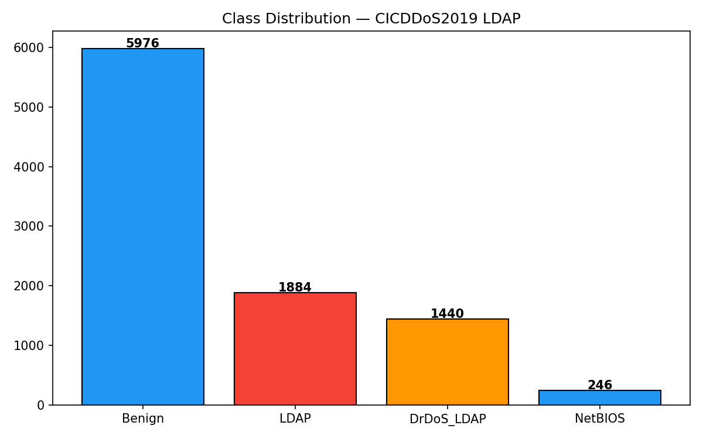
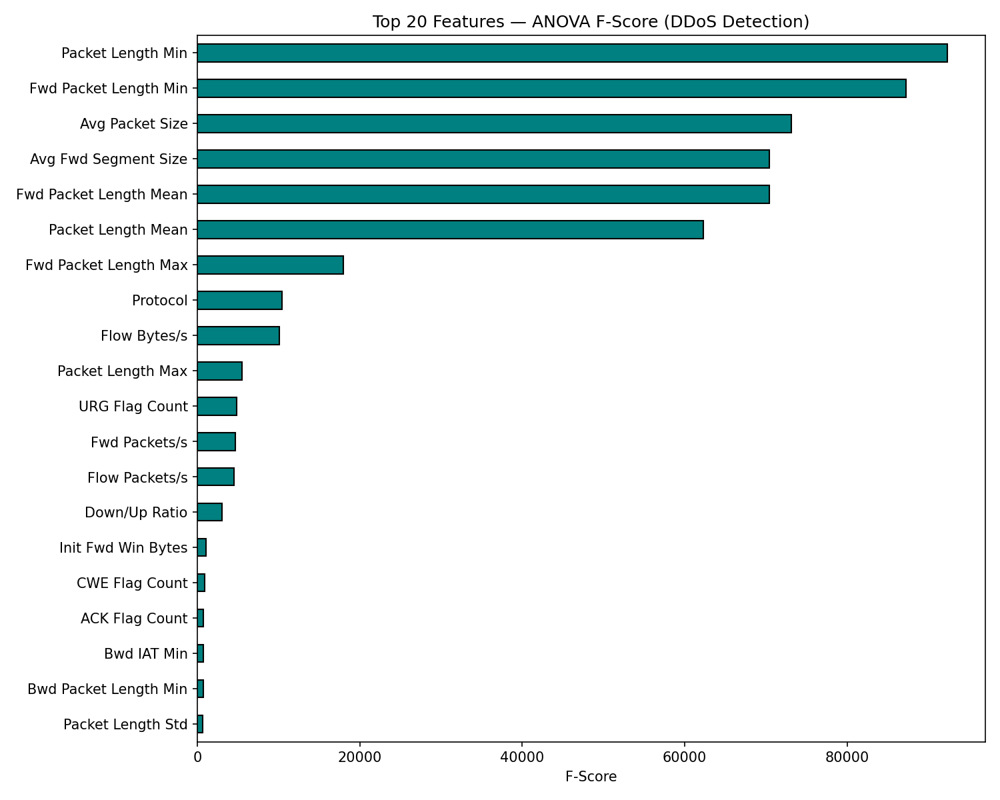
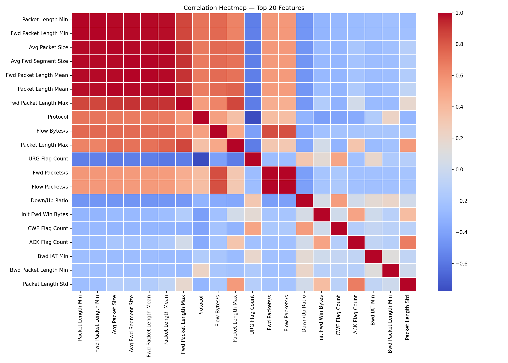
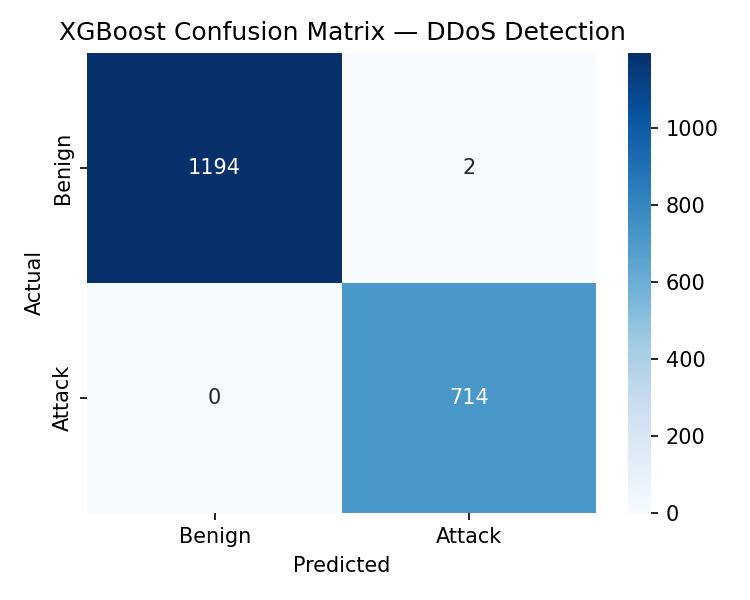
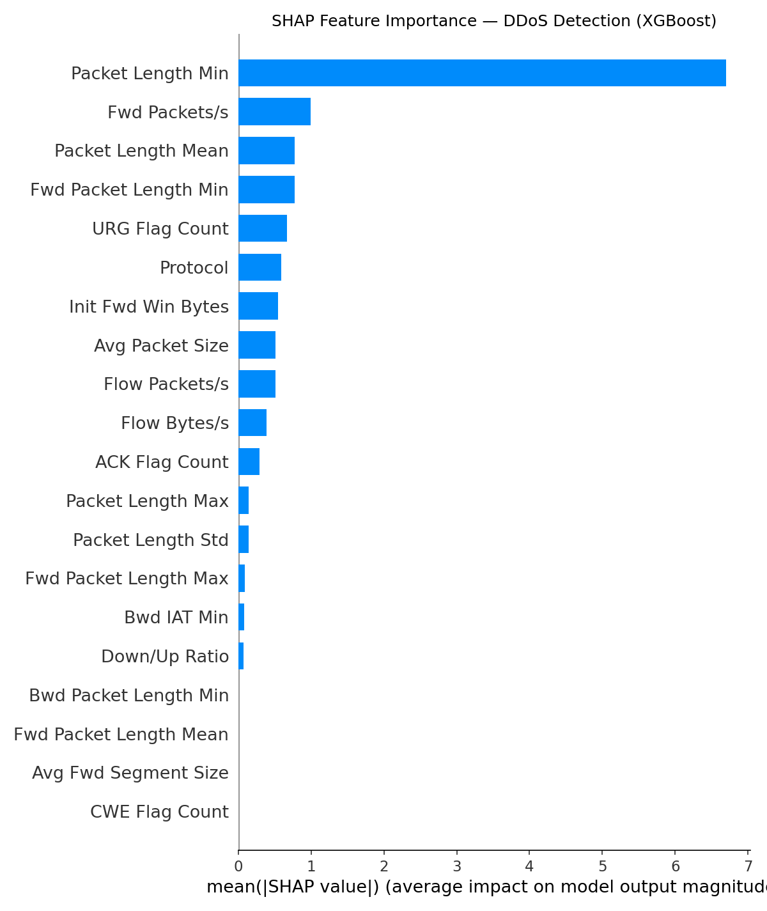
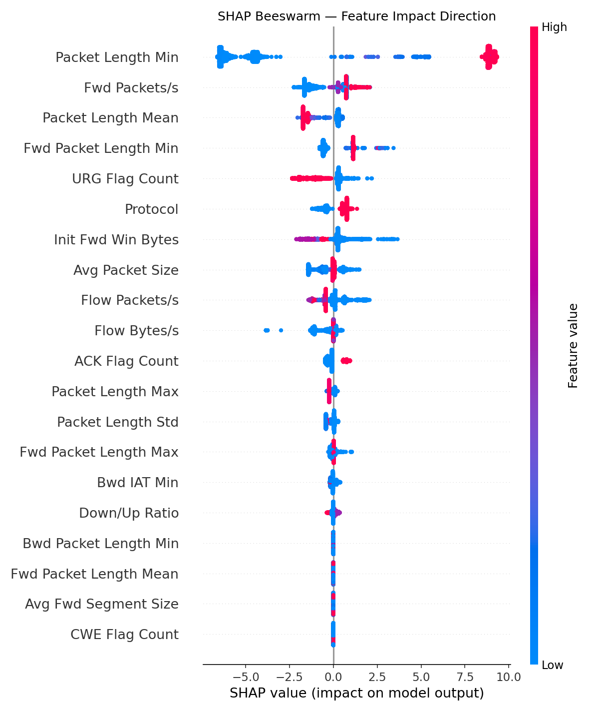

# DDoS Detection Using CIC-DDoS2019 — Capstone Project

A machine learning pipeline for multi-class and binary DDoS attack detection using the CIC-DDoS2019 dataset. 
This project covers the full data science workflow from EDA to model explainability, with threat intelligence artifacts mapped to MITRE ATT&CK.
This is my MS Capstone project.

---

## Project Structure

```
├── DDOS-detection-Capstone-EDA.ipynb
├── DDOS-detection-Capstone-Preprocessing.ipynb
├── DDOS-detection-Capstone-Feature-Engineering.ipynb
├── DDOS-detection-Capstone-Modelling.ipynb
├── DDOS-detection-Capstone-SHAP.ipynb
├── data/
├── models/
└── outputs/
```

---

## Workflow

1. **EDA** — Class distribution, flow duration analysis, correlation matrix
2. **Preprocessing** — Null handling, encoding, train/test splits per attack type
3. **Feature Engineering** — Top 20 features, scaled features, pairplot analysis
4. **Modelling** — XGBoost binary + multi-class classification, confusion matrix evaluation
5. **Explainability** — SHAP summary and beeswarm plots for feature importance

---

## Outputs

| File | Description |
|------|-------------|
| `01_class_distribution.png` | Attack type class balance |
| `02_flow_duration.png` | Flow duration distribution per class |
| `03_correlations.png` | Feature correlation overview |
| `04_top20_features.png` | Top 20 most important features |
| `05_correlation_heatmap.png` | Full correlation heatmap |
| `06_boxplots_top6.png` | Boxplots for top 6 features |
| `07_pairplot.png` | Pairplot across key features |
| `08_confusion_matrix_xgb.png` | XGBoost confusion matrix |
| `09_shap_summary.png` | SHAP summary plot |
| `10_shap_beeswarm.png` | SHAP beeswarm plot |
| `model_results.csv` | Model performance metrics |
| `mitre_mapping.csv` | MITRE ATT&CK technique mapping |
| `ddos_kql_rules.kql` | KQL detection rules for SIEM |
| `ddos_sigma_rules.yml` | Sigma rules for threat detection |

---

## Visual Highlights

### Class Distribution


### Top 20 Features


### Correlation Heatmap


### Confusion Matrix — XGBoost


### SHAP Summary


### SHAP Beeswarm


---

## Dataset

**CIC-DDoS2019** — Canadian Institute for Cybersecurity  
Attack types: DNS, LDAP, MSSQL, NetBIOS, NTP, Portmap, SNMP, Syn, TFTP, UDP, UDPLag

---

## Tech Stack

- Python, Pandas, NumPy
- XGBoost, Scikit-learn
- SHAP, Matplotlib, Seaborn
- KQL, Sigma Rules, MITRE ATT&CK
